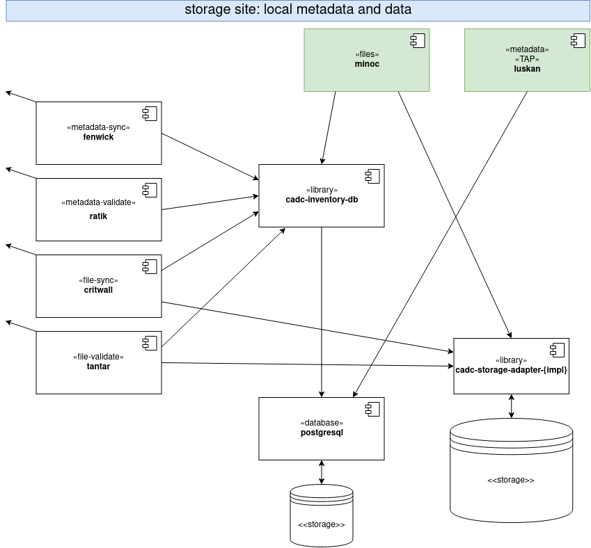
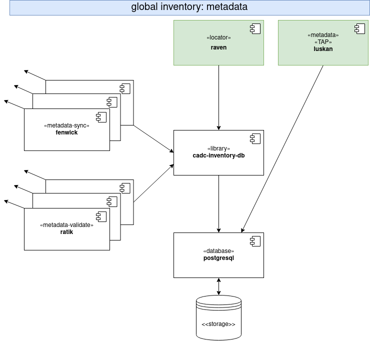

# OpenCADC Storage Inventory System

The Storage Inventory system is designed to manage archival file storage for a science
data archive. 

The system is designed to have one or more sites that implement services built on the 
[Storage Inventory Data Model](storage-inventory-dm/).

- a **storage site** includes back-end storage (for files), a database with the local inventory,
a **files** service, and a **metadata** service

- a **global inventory** includes a database with an inventory of all files at all known storage 
sites, a **locator** service, a **metadata** service, a **metadata-sync** process for each storage 
site, and a periodic **metadata-validate** process for each storage site

A storage site can be useful as a stand-alone deployment that provides REST API access to back 
end storage, but the deployment of a global inventory allows multiple storage sites to store a
collection of files distributed across the sites for additional redundancy, proximity to users
and/or computational resources, etc. 

With the deployment of a global inventory, one would normally add **metadata-sync** and **file-sync** 
process(es) to storage sites to sync content that originates at other sites. There are mechanisms
to apply selectivity in order to sync a subset of the global inventory to any one storage site.

 
In addition to **storage site**s and **global inventory**, there are several external services that 
are required for a complete functional system:

- a **registry** service to lookup the current URL of other services; uses service identifiers
(IVOA resourceID as one would find in an IVOA registry)
- one or more **users** and **groups** service(s) to support authentication (users) and authorization (groups);
permission grants are expressed as grants to a group (of users) and membership in a group is verified
using the <a href="https://www.ivoa.net/documents/GMS/">IVOA GMS</a> API implemented by **groups** service(s)
- one or more **permissions** services which return grant information for resources (files); the permissions
API is a prototype (non-standard)

# high level features

arbitrary logical organisation of archive files (Artifact.uri)
- Artifact.uri prefixes define **namespace**s
- namespace supports artifact selection (mirroring) policy
- namespace supports rule-based granting of permission to read or write files

one or more storage sites with local inventory and data storage
- artifact selection (mirroring) policy implemented at each site
- different back end storage implementation can be used at each site
- files stored at multiple network/geographical locations for redundancy, scalability, and
to improve delivery to users/processing/science platforms

one or more independent global inventory(ies) of all files and their locations
- file locations stored at multiple network/geographical locations for redundancy, scalability
- specialised global inventory(ies) can be created with subset of files

rapid incremental metadata propagation and robust metadata validation
- site(s) to global
- global to site(s)

scalable validation of external references to stored files
- CAOM vs storage
- VOSpace vs storage
- global vs site(s)
- site(s) vs global

# transition features

There are no transition-specific tools: the system is in a continuous state of transition and the normally
synchronization processes bring it to the new desired state.

Example: change back end storage from technology A to technology B:
- deploy a storage site with a new (empty) database and new (empty) object store allocation
- add new site to list of sites known to global
- **metadata-sync** will pull selected artifacts from global to site database
- **file-sync** will pull files for those artifacts using global **locator** service (from other storage sites)
- when all files are redundantly stored, decommission the old storage site

# more info

[FAQ](docs/FAQ.md)

# what's NOT included

quotas, allocations, resource management

monitoring, control, or config of back end storage systems
- use their tools

monitoring or control of processes and services
- use container orchestration: docker swarm? kubernetes? something even shinier?

reporting
- get logs from containers
- query site **metadata** service (TAP)
- query global **metadata** service (TAP)

# software components

## storage-inventory-dm
This is the storage inventory data model and architecture documentation. TODO: Add an FAQ.

## baldur
This is an implementation of the **permissions** service API using configurable rules to grant access 
based on resource identifiers (Artifact.uri values in the inventory data model).

## critwall
This is an implementation of the **file-sync** process that runs at a storage site and downloads files.

## fenwick
This is an implementation of the **metadata-sync** process that runs at both global inventory and at
storage sites.

## luskan
This is an implementation of the **metadata** service that enables querying the storage inventory at
both global inventory and storage sites. It is an <a href="https://www.ivoa.net/documents/TAP/">IVOA TAP</a> 
service that supports ad-hoc querying of the inventory data model.

## minoc
This is an implementation of the **file** service that supports HEAD, GET, PUT, POST, DELETE operations
and <a href="https://www.ivoa.net/documents/SODA/">IVOA SODA</a> operations.

## raven
This is an implementation of the global **locator** service that supports transfer negotiation and direct
file GET requests.

## ratik
This is an implementation of the **metadata-validate** process that runs at both global inventory and at
storage sites.

## ringhold
This is an implementation of part of the **metadata-validate** process that cleans up after a change in 
local artifact selection policy. This is used if the new fenwick policy excludes artifacts previously synced.

## tantar
This is an implementation of the **file-validate** process that compares the inventory database against 
the back end storage at a storage site.

## cadc-*
These are libraries used in multiple services and applications.

- cadc-inventory: core data model implementation
- cadc-inventory-db: database library
- cadc-inventory-util: re-usable code
- cadc-inventory-server: re-usable service code
- cadc-storage-adapter: defines the interface between inventory and back end storage
- cadc-storage-adapter-fs: storage adapter implementation for a POSIX filesystem back end
- cadc-storage-adapter-ad: storage adapter for the legacy CADC Archive Directory storage system (temporary)
- cadc-storage-adapter-swift: storeage adapter implementation for the Swift Object Store API (e.g. CEPH Object Store)
- cadc-storage-adapter-test: re-usable test suite for storage adapter implementations
