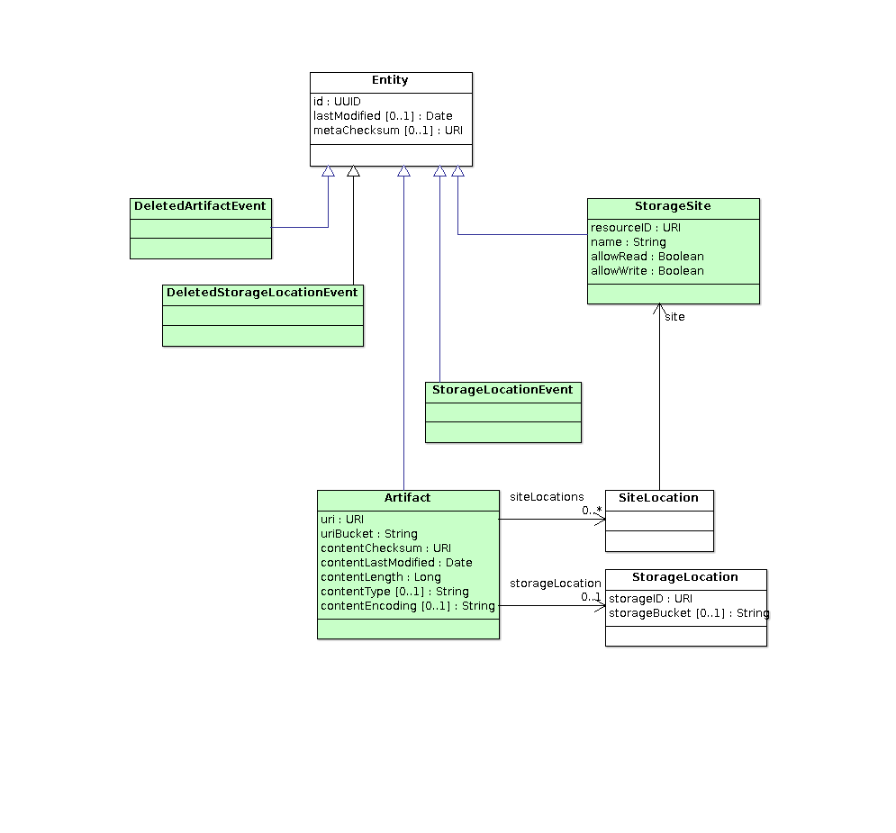

 The Storage Inventory data model is licensed under the
<a rel="license" href="http://creativecommons.org/licenses/by-sa/4.0/">
Creative Commons Attribution-ShareAlike 4.0 International License</a>.

# high level features

arbitrary organisation of archive files (File.uri)
- file organisation supports mirroring policy

one or more independent global inventory(ies) of all files and their locations
- specialised global inventory(ies) can be created (eg vault can have it's own copy of global)

one or more storage sites with local inventory and data storage
- arbitrary mirroring policies at each site
- different back end storage implementation (assumed off-the-shelf)

incremental metadata propagation and robust metadata validation
- site to global
- global to site

scalable validation using uri, uriBucket
- CAOM vs storage
- vault vs storage
- global vs site
- site vs global

multiple storage backends in use at any one time

# transition plan features

no throw-away transition tools or development (CT: continuous transition)

no "big switch": 
- start with AD site
- operate with AD in parallel with other (types of) sites
- eventually retire AD?

# what's NOT included

quotas, allocations, resource management

monitoring, control, or config of back end storage systems
- use their tools

monitoring or control of processes and services
- use kubernetes

reporting
- get logs from containers
- query site inventory
- query global inventory

# storage-dm
Storage Inventory (SI) Data Model

This module contains a <a href="http://www.ivoa.net/documents/VODML/index.html">VO-DML</a> 
description of the Storage data model and test code to validate the model using the 
<a href="https://github.com/opencadc/core/tree/master/cadc-vodml">cadc-vodml</a> tools.

Development starts with the UML diagrams and the current version may be ahead of the generated
VO-DML documentation. 

# Artifact.uri
This URI is a globally unique logical identifier that is typically known to and may be defined by some other system 
(e.g. an Artifact.uri in CAOM or storageID in a storage-system backed VOSpace like ivo://cadc.nrc.ca/vault). 

{scheme}:{relative-path}

For all URIs, the filename would be the last component of the path. There is no explicit namespace: arbitrary sets of files
can be defined with a prefix-pattern match on uri. Such sets of files would be used in validation and in site mirroring 
policies. Normal CADC practice is to use the scheme and first path component (archive name) as a namespace.

Example usage of uri values:

**ad:{archive}/{filename}** *classic*

**cadc:{path}/{filename}** *new*

**mast:{path}/{filename}** *in use now*

Artifact.uri is a semantically meaningful identifier that remains unchanged when the Artifact is mirrored or synced to different sites. Local code/configuration is used to resolve this identifier to a URL for data access. For externally harvested and sync'ed CAOM artifacts, we would use the URI as-is in the Artifact.uri field.

Validation of CAOM versus storage requires querying CAOM (1+ collections) and storage (single namespace) and 
cross-matching URIs to look for anomalies.

For vault (vospace), data nodes would have a generated identifier and use something like cadc:vault/{uuid} or vault:{uuid} 
(but not containing the logical filename in VOSpace). There should be no use of the "vos" scheme in a uri so paths within the vospace never get used in storage and move/rename operations (container or data nodes) do not effect the storage system.  Validation of vault versus storage requires querying vault (and building uri values programmatically unless
vault db stores the full URI) and storage and cross-matching to look for anomalies.

Since we need to support mast and vault schemes (at least), it is assumed that we would use the "cadc" scheme going 
forward and support (configure) the "ad" scheme for backwards compatibility. 

# external services
Services that make up the storage site or global inventory depend on other CADC services. The registry lookup API permits caching; this is already implemented and effective. The permissions API could be designed to support caching or mirrors. The user and group APIs could be modified to support caching or mirroring. Caching: solve a problem by adding another problem.

# storage site
A storage site tracks all files written to local storage. These files can be harvested by anyone: central inventory, 
clones, backups, etc. A storage site is fully consistent w.r.t local file operations (e.g. put + get + delete).

Storage sites:
- track writes of local files (persist File + StorageLocation)
- implement get/put/delete service API
- implement policy to sync Artifact(s) from global
- implement file sync from other sites using global transfer negotiation
- implement validation of file metadata vs storage

A storage site maintains StorageLocation->Artifact for Artifact(s) in local storage. Local policy syncs a subset of File(s)
from global; new Artifact(s) from other sites would have no matching StorageLocation and file-sync would know to retrieve
the file. Local put creates the StorageLocation directly.

# global inventory
A global inventory service is built by harvesting sites, files, and deletions from all known sites.
A global inventory is eventually consistent.

Global inventory (may be one or more):
- harvests StorageSite metadata from storage sites
- harvests Artifact + DeletedArtifactEvent + DeletedStorageLocationEvent from storage sites (persist Artifact + SiteLocation)
- implements transfer negotiation API

Rather than just accumulate new instances of Artifact, the harvested File may be a new Artifact or an existing Artifact 
at a new site that has to be merged into the global inventory. Thus, Artifact.lastModified in a global inventory is not 
equal to the values at individual storage sites. TBD: should global store the min(lastModified from sites)? max(lastModified from sites)? act like origin and store current timestamp?.

The metadata-sync tools could allow for global policy so one could maintain a global view of a defined set of file. 
This might be useful so vault could maintain it's own global view and not rely on an external global inventory service 
for transfer negotiation.

# patterns, ideas, and sometimes incomplete thoughts...

## file operations
Basic put/get/update/delete operations:
- put: PUT /srv/files/{uri}
- get: GET /srv/files/{uri}
- upate: POST /srv/files/{uri}
- delete: DELETE /srv/files/{uri}
- mirroring policy at sites will (mostly) be based on information in the Artifact.uri (chose wisely)
- cannot directly access vault files at a site - must use transfer negotiation with vault (no real change)
- POST can modify mutable metadata: Artifact.uri (rename), Artifact.contentType, Artifact.contentEncoding

## locate 
Files are located and accessed using transfer negotiation:
- GET: negotiate with global, locate available copies, return URL(s), order by proximity
- PUT: negotiate with global, locate writable sites, return URL(s), order by proximity -- try to match policy? (like--)
- POST and DELETE: negotiate with global, locate available copies at writable sites, return URL(s), order by proximity
- POST and DELETE (alt): modify|delete Artifact in global? update Artifact.lastModifed|delete and creates DeletedArtifactEvent, sites harvest
- **eventual consistency**: if caller wants to put *then* get a file the client must be aware of eventual consistency
- global: implement heartbeat check with sites so negotiated transfers likely to work
- vault transfer negotiation maps vos {path} to DataNode.uuid and then negotiates with global (eg, for Artifact.uri ~ vault:{uuid})
- vault implementation could maintain it's own global inventory of vault files (policy)

## curl-wget
How does a curl/wget user download a file without knowing where it is?
- an endpoint like the files endpoint that supports GET only can be implemented as part of global deployment
- this is a convenience feature so it is not part of the core design (just for clarity)
- a simple "I'm feeling lucky" implementation could just redirect to the highest ranked negotiated transfer

## overwrite a file 
Overwriting a file at storage site: atomic delete + create
- create DeletedArtifactEvent with old UUID
- create a new Artifact (new UUID), Artifact.lastModified/metaChecksum must change, global harvests, sites harvest
- before global harvests: eventually consistent (but detectable by clients in principle)
- after global harvests: consistent (only new file accessible, sites limited until sync'ed
- direct access: other storage sites would deliver previous version of file until they sync
- sequence of events: DeletedArtifactEvent.lastModified <= new Artifact.lastModified -> metadata-sync tries to process events in order
- **race condition** - put at two different sites -> two Artifact(s) with same uri but different id: resolve collision by keeping the one with max(Artifact.contentLastModified)

## propagate delete 
How does delete file get propagated?
- delete from any site with a copy; delete harvested to global and then to other sites
- process harvested delete by Artifact.id so it is decoupled from put new file with same name
- **race condition** - delete and put at different sites -> the put wins by nature 
- **eventual consistency**: if caller wants to put *then* delete a file the client must be aware of eventual consistency
- delete by Artifact UUID is idempotent so duplicate DeletedArtifactEvent records are ok

## lastModified updates
How does global learn about copies at sites other than the original?
- when a site file-sync completes (adds a local StorageLocation): update the Artifact.lastModified
- when global metadata-sync from site(s) see this and tracks (add a SiteLocation): update Artifact.lastModified
- metadata-sync never modifies Entity metdata: id, metaChecksum never change during sync
- eventually: Artifact.lastModified will be the latest change at all sites, but that doesn't stop metadata-sync from processing an "event" out of order and merging in the new SiteLocation

## cache site
How would a temporary cache instance at a site be maintained?
- site could accept writes to a "cache" instance for Artifact(s) that do not match local policy
- site metadata-validate can delete once the artifact+file are synced to sites where it does match policy: global has multiple SiteLocation(s)
- metadata-validate removed the Artifact and creates a DeletedStorageLocationEvent; file-validate cleans up local copy of file
- files could sit there orphaned if no one else wants/copies them
- a pure cache site is simply a site with local policy of "no files" and does not need to run metadata-sync w/ global

## metadata-validate
How does global inventory validate vs a storage site?  how does a storage site validate vs global?
- validation is a *set* operation between equivalent sets: local vs remote
- validation can only repair the local set
- validate subsets of artifacts (in parallel) using Artifact.uriBucket prefix
- validate ordered streams to minimise memory requirements (large sets)

**Local L** L is the set of artifacts in the local database; if L is global, it is the subset that
should match R.

**Remote R**: This set is the artifacts in the remote site that match the current filter policy.

The approach is to iterate through sets L and R, look for discrepancies, and fix L. There are only 
minor differences if validating global L.

*discrepancy*: artifact in L && artifact not in R

    explanation0: filter policy at L changed to exclude artifact in R
    evidence: Artifact in R without filter && remoteArtifact.lastModified < remote-query-start
    action: if L==storage, check num_copies>1 in R, delete Artifact, create DeletedStorageLocationEvent
            if L==global, delete Artifact (no event)

    explanation1: deleted from R, pending/missed DeletedArtifactEvent in L
    evidence: DeletedArtifactEvent in R 
    action: put DAE, delete artifact
    
    explanation2: L==global, deleted from R, pending/missed DeletedStorageLocationEvent in L
    evidence: DeletedStorageLocationEvent in R 
    action: remove siteID from Artifact.siteLocations (see below)

    explanation3: L==global, new Artifact in L, pending/missed Artifact or sync in R
    evidence: ?
    action: remove siteID from Artifact.siteLocations (see below)
    
    explanation4: L==storage, new Artifact in L, pending/missed new Artifact event in R
    evidence: ?
    action: none
    
    explanation5: TBD

    explanation6: deleted from R, lost DeletedArtifactEvent
    evidence: ?
    action: if L==global, assume explanation3
    
    explanation7: L==global, lost DeletedStorageLocationEvent
    evidence: ?
    action: assume explanation3
    
    note: when removing siteID from Artifact.storageLocations in global, if the Artifact.siteLocations becomes empty:
        the artifact should be deleted (metadata-sync needs to also do this in response to a DeletedStorageLocationEvent)
        Deletion when siteLocations becomes empty due to DeletedStorageLocationEvent must not generate a DeletedArtifactEvent.

*discrepancy*: artifact not in L && artifact in R

    explantion0: filter policy at L changed to include artifact in R
    evidence: ?
    action: equivalent to missed Artifact event (explanation3/4 below)
    
    explanation1: deleted from L, pending/missed DeletedArtifactEvent in R
    evidence: DeletedArtifactEvent in L
    action: none

    explanation2: L==storage, deleted from L, pending/missed DeletedStorageLocationEvent in R
    evidence: DeletedStorageLocationEvent in L
    action: none

    explanation3: L==storage, new Artifact in R, pending/missed new Artifact event in L
    evidence: ?
    action: insert Artifact
    
    explanation4: L==global, new Artifact in L, stale Artifact in R
    evidence: artifact in L without siteLocation constraint
    action: resolve as ID collision
    
    explanation5: L==global, new Artifact in R, pending/missed changed Artifact event in L
    evidence: ?
    action: insert Artifact and/or add siteLocation
    
    explanation6: deleted from L, lost DeletedArtifactEvent
    evidence: ?
    action: assume explanation3 or 5
    
    explanation7: L==storage, deleted from L, lost DeletedStorageLocationEvent
    evidence: ?
    action: assume explanation3

*discrepancy*: artifact.uri in both && artifact.id mismatch (collision)

    explantion1: same ID collision due to race condition that metadata-sync has to handle
    evidence: no more evidence needed
    action: pick winner, create DeletedArtifactEvent for loser, delete loser if it is in L, insert winner if winner was in R

*discrepancy*: artifact in both && valid metaChecksum mismatch

    explanation1: pending/missed artifact update in L
    evidence: local artifact has older Entity.lastModified indicating an update to optional metadata at remote
    action: put Artifact
    
    explanation2: pending/missed artifact update in R
    evidence: local artifact has newer Entity.lastModified indicating the update happened locally
    action: do nothing
    
*discrepancy*: artifact in both && siteLocations does not include R (L==global)

    explanation: pending/missed new Artifact event from storage site (after file-sync)
    evidence: remote siteID not in local Artifact.siteLocations
    action: add siteID to Artifact.siteLocations

## file-validate
How does a storage site validate vs local storage system?
- compare List of Artifact+StorageLocation vs storage content using storageID
- use storageBucket prefix to batch validation
- use sorted iterator to stream (merge join) for validation, order by StorageLocation
- if file in inventory & not in storage: pending file-sync job
- if file in storage and not in inventory && can generate Artifact.uri: query global for existing Artifact, create StorageLocation, maybe create Artifact
- if file in storage and not in inventory && cannot generate Artifact.uri: delete from storage? alert operator?
- if file in storage and inventory: compare checksum and length && act on discrepancies

## bit-rot
What happens when a storage site detects that a Artifact.contentChecksum != storage.checksum?
- depends on whether the storage checksum matches bytes or is simply an attached attribute
- if attached attr: can be used to detect that file was overwritten but inventory update failed
- if actual storage checksum: how to disambiguate bit-rot from update inconsistency?
- if copies-in-global: delete the Artifact and the stored file, fire DeletedStorageLocationEvent, re-sync w.r.t policy?
- if !copies-in-global: mark it bad && human intervention

## should harvesting detect if site Artifact.lastModified stream is out of whack?
- non-monotonic, except for volatile head of stack?
- clock skew

# storage back end implementation notes
The cadc-storage-adapter API places requirements on the implementation:

0. ~fixed overhead to access a stored file (put, get)... scales moderately at best with number of files stored (indexed)
1. store (via put) and return (via iterator) metadata (min: Artifact.uri, Artifact.contentChecksum, Artifact.contentLength)
2. update metadata after a write: checksum not known before write, update Artifact.uri (rename)
3. streaming write: content length not known before write
4. consistent timestamp: contentLastModfied from put and iterator
5. support random access: resumable download, metadata extraction (fhead, fwcs), cutouts
6. support iterator (ordered by StorageLocation) *or* batched list (by storageBucket): **preferably both**

Y=yes S=scalability issues N=not possible

|feature|opaque filesystem|mountable fs (RO)|mountable fs (RW)|ceph+rados|ceph+S3|ceph+swift|AD + /data|
|-------|:---------------:|:---------------:|:---------------:|:--------:|:-----:|:--------:|:--------:|
|fixed overhead         |Y |Y?|Y?|Y |Y |Y|Y|
|store/retrieve metadata|Y |Y |Y |? |Y |Y|Y|
|update metadata        |Y |Y |Y |? |X |Y|N|
|streaming write        |Y |Y |Y |? |N |Y|Y|
|consistent timestamp   |Y |Y |Y |? |S?|Y|Y|
|random access          |Y |Y |Y |Y?|Y?|Y|Y|
|iterator               |Y |S |S |? |Y |Y|Y|
|prefix iterator        |Y |S |S |? |Y |Y|N|
|batch iterator         |Y |S |S |? |Y |Y|Y|
|prefix batch iterator  |Y |S |S |? |Y |Y|N|

For opaque fs: random hierarchical "hex" bucket scheme can give many buckets with few files, so scalability comes from
using the directory structure (buckets) to maintain finite memory footprint. The hex bucket scheme is implementing a B-tree scheme with directories (more or less).

For mountable RO filesystem: Artifact.uri structure maps to directories and files is only as scalable as is implied by 
the Artifact.uri organisation; validation (iterator) is not scalable (NS) for current practices (too flat).

For mountable RW filesystem (e.g. cavern): in addition to RO issues above, simple operations in the filesystem (mv) can
invalidate an arbitrary number of storageID values, make all those artifacts inaccessible, and cause file-validate to do 
an arbitrary amount of work to fix the storageID values. It is not feasible to avoid treating it as a new Artifact and
DeletedArtifactEvent that gets propagated to all sites unless you trust the Artifact.contentChecksum to be a unique 
and reliable identifier. Also, files created via the FS would not have metadata (checksum) so that would have to be computed
out of band and the iterator/list implementation would have to not expose the file until that happened.

For ceph+rados: native code is required so not all features were explored in detail.

For ceph+S3: the S3 API requires content-length before a write and treats stored objects as immutable so you cannot update
metadata once an object is written. Ceph+S3 also has a maximum size for writing an object (5GiB), after which clients must
use the multi-part upload API... that would have to be exposed to clients.

For ceph+swift: the Swift API allows changes to stored object metadata and allows streaming,. although still subject to a 5GiB
default object size limit before multi-part API must be used.

For AD: storageBucket = {archive} so there is no control over batch size via prefixing the bucket.

